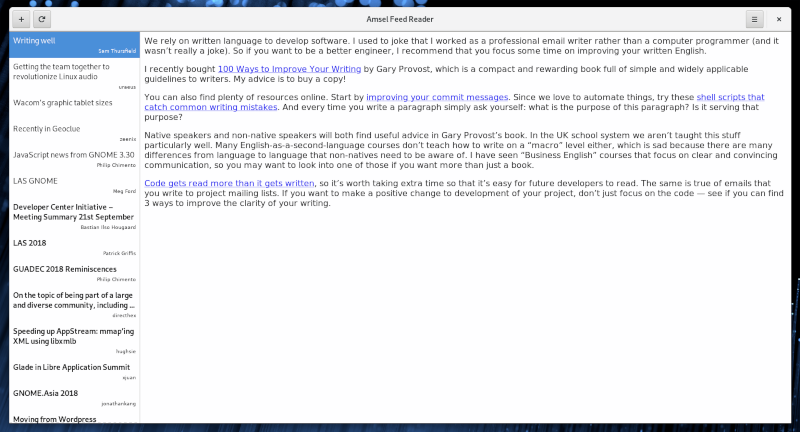

#  Amsel Feed Reader

This application is a basic feed reader for RSS/Atom feeds. It's a playground
for various experiments i do to improve my software engineering skills. If you
search for a full featured feed reader then i can recommend 
[Feed Reader](https://github.com/jangernert/FeedReader).

Most of the time i read feeds via a online service (Feedly) and i really like
it, that my read status is synchronized and i can read with multiple devices.
On the desktop, i would love to have a little app in the background, which
has a low memory footprint and pulls news periodically. Additionally i want
that i can build up a database with all feeds ever fetched. This requirements
led to **Amsel**.

This application is in early alpha stage. I try to accomplish regular releases
and try to comply to "release early - release often". At the moment, there is
only local rss fetching and presentation. I will change that in the future.

## Build

Clone the repository or download the release tarball

```sh
$ meson build
$ ninja -C build
$ build/src/amsel
```

If you want to help active to report bugs or contribute so please enable
tracing for better reports.

```sh
$ meson build
$ meson configure -Denable_tracing=true build
$ ninja -C build
$ build/src/amsel
```

## Screenshot



## Development

Just some words about the architecture. I separated the business logic into
its own library (called here alb for amsel backend) and the presentation layer
in a executable (aml for amsel). I tried to follow the clean architecture
principle presented by uncle bob. The backend is not dependend on where the
data is coming. There are at the moment 2 parser for rss and atom. In the
future i want additional parser for feedly json data or other services. The 
nice thing about this way to work is that i don't have a high coheasion between
gui and backend. There are defined interfaces which provides access to the
backend in a sane way. This way it would be simple to add other ways of
interaction with the backend like a command line application or another toolkit.

